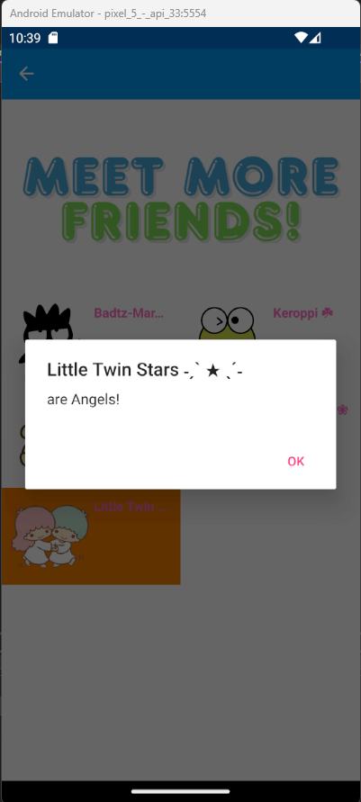
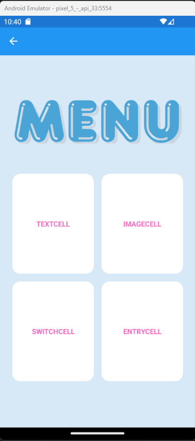
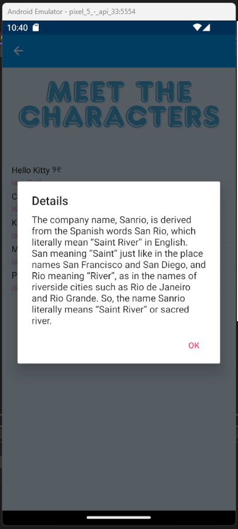
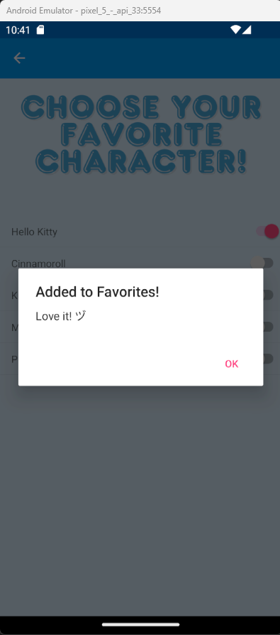
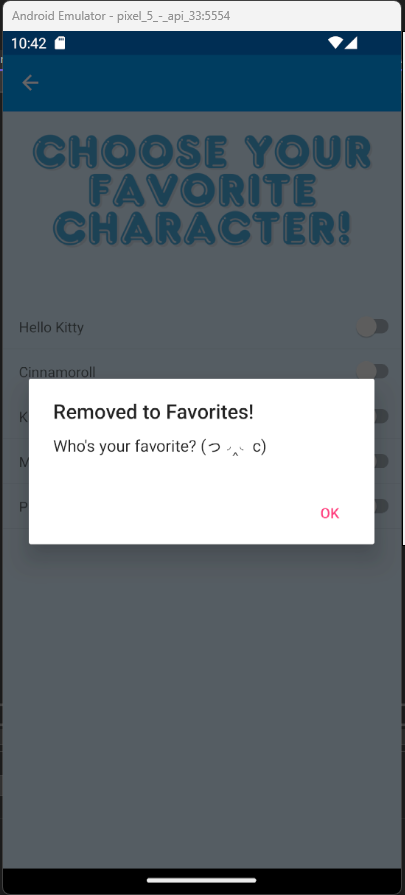
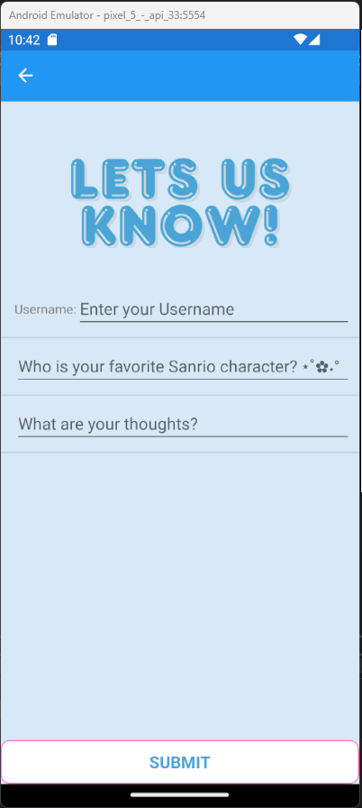
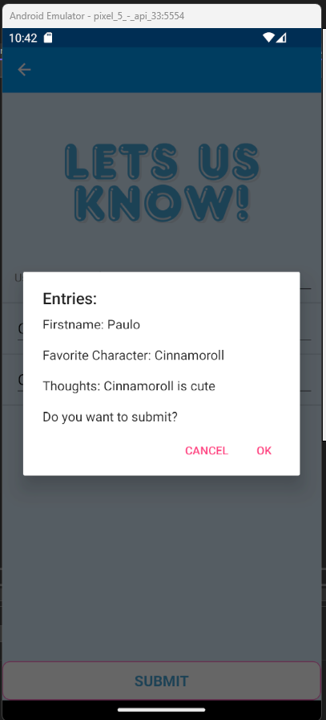

# PDC03 Module 04 - Exercise01

## MainPage
[Mainpage.xaml](Module04View/MainPage.xaml)
[Mainpage.xaml.cs](Module04View/MainPage.xaml.cs)

## CollectionView
[CollectionView.xaml](Module04View/CollectionView.xaml)
[CollectionView.xaml.cs](Module04View/CollectionView.xaml.cs)

## ListView
[ListView.xaml](Module04View/ListView.xaml)
[ListView.xaml.cs](Module04View/ListView.xaml.cs)

## TextCell
[TextCell.xaml](Module04View/TextCell.xaml)
[TextCell.xaml.cs](Module04View/TextCell.xaml.cs)

## ImageCell
[ImageCell.xaml](Module04View/ImageCell.xaml)
[ImageCell.xaml.cs](Module04View/ImageCell.xaml.cs)

## SwitchCell
[SwitchCell.xaml](Module04View/SwitchCell.xaml)
[SwitchCell.xaml.cs](Module04View/SwitchCell.xaml.cs)

## EntryCell
[EntryCell.xaml](Module04View/EntryCell.xaml)
[EntryCell.xaml.cs](Module04View/EntryCell.xaml.cs)

## CS FILE
[Sanrio.cs](Module04View/Sanrio)
