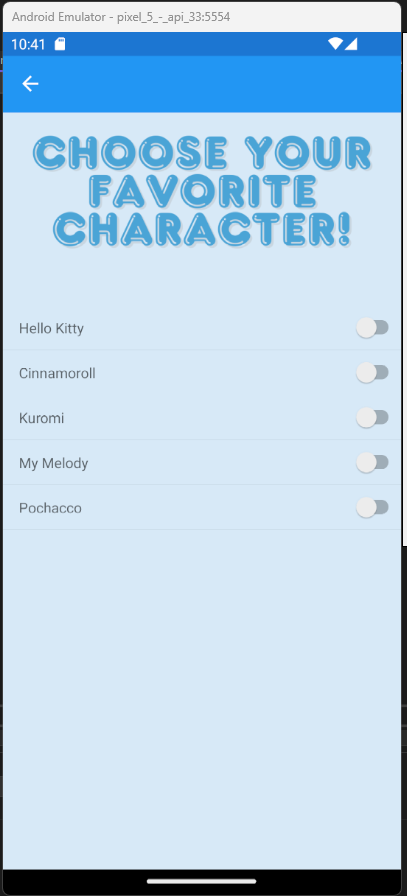

# PDC03 Module 04 - Exercise01

## MainPage
[Mainpage.xaml](Module04View/MainPage.xaml)
[Mainpage.xaml.cs](Module04View/MainPage.xaml.cs)

## ListView
[ListView.xaml](Module04View/ListView.xaml)
[ListView.xaml.cs](Module04View/ListView.xaml.cs)

## SwitchCell
[SwitchCell.xaml](Module04View/SwitchCell.xaml)
[SwitchCell.xaml.cs](Module04View/SwitchCell.xaml.cs)

